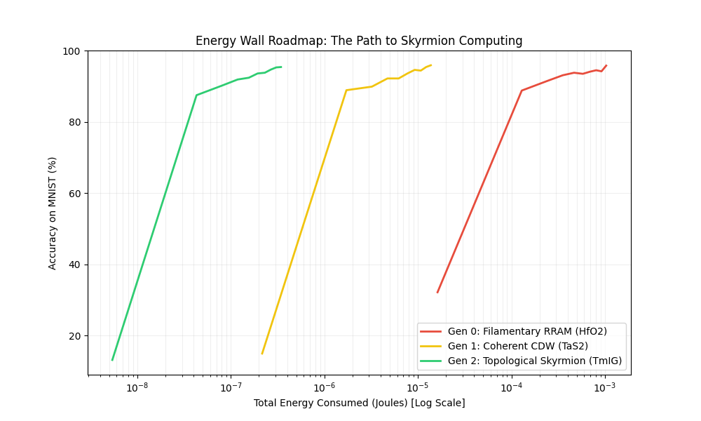

# Comparative Simulation of Filamentary, CDW, and Skyrmion Memory Architectures for Neuromorphic Computing

## Project Overview
This repository contains a PyTorch simulation benchmarking three generations of non-volatile memory technologies in a neural network training task (MNIST). The objective is to evaluate the impact of physical constraints—specifically write energy and read noise—on model convergence and total energy efficiency.

## Physical Models
The simulation implements three distinct memory architectures, parameterized based on experimental data for switching energy and stochastic noise characteristics.

| Generation | Technology | Material | Energy per Op | Noise ($\sigma$) | Physical Mechanism |
|------------|------------|----------|---------------|------------------|--------------------|
| **Gen 0** (Baseline) | Filamentary RRAM | $HfO_2$ | 150 fJ | 0.08 | Filament formation/rupture with Random Telegraph Noise (RTN). |
| **Gen 1** (Intermediate) | Coherent CDW | $1T-TaS_2$ | 2 fJ | 0.005 | Collective charge density wave sliding. |
| **Gen 2** (Target) | Topological Skyrmions | $TmIG$ | 0.05 fJ | 0.0005 | Topological protection with resonant magnon-driven switching. |



## Methodology
The simulation utilizes a custom `PhysicsLinear` layer in PyTorch, which extends standard linear transformations to incorporate hardware-specific constraints:
1.  **Energy Tracking**: Accumulates energy consumption per Multiply-Accumulate (MAC) operation based on the material's specific energy profile.
2.  **Noise Injection**: Injects Gaussian noise into the activation outputs during the forward pass to simulate device stochasticity and thermal fluctuations.

**Dataset**: MNIST (Handwritten Digits).
**Metrics**: Validation Accuracy vs. Total Energy Consumption (Joules).

## Results
The simulation generates a comparative roadmap (`energy_wall_roadmap.png`) visualizing the energy-accuracy trade-off.

*   **Logarithmic Scale**: The X-axis (Energy) is presented on a logarithmic scale to accommodate the wide dynamic range between technologies.
*   **Efficiency Gap**: The Skyrmion (TmIG) model demonstrates convergence with approximately 4 orders of magnitude less energy consumption compared to the RRAM baseline, highlighting the potential of topological computing for energy-constrained environments.

## Usage

### Prerequisites
*   Python 3.x
*   PyTorch
*   Torchvision
*   Matplotlib
*   Numpy

### Installation
```bash
pip install -r requirements.txt
```

### Execution
Run the simulation to generate the roadmap plot:
```bash
python sim/skyrmion_core.py
```
